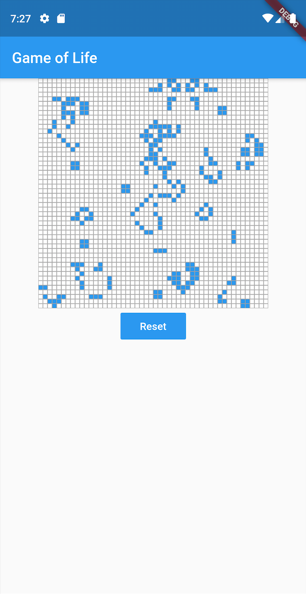
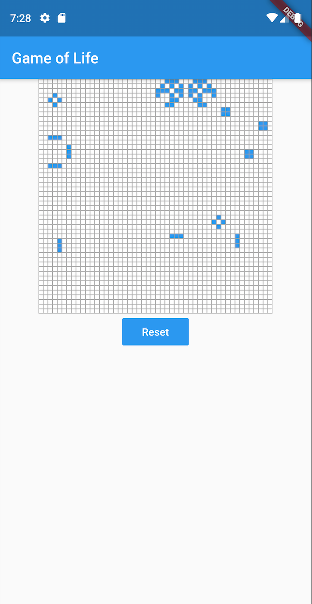
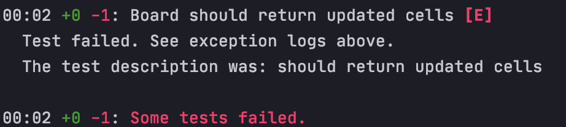

# El Juego de la Vida en Flutter (Dart): desarrollo y testing

-------

**EQUIPO**

MacBook Pro (15-inch, Mid 2015), con **macOS** 10.14.6

Procesador: 2,5 GHz Intel Core i7

Memoria: 16 GB 1600 MHz DDR3


**TERMINAL** (Se puede utilizar también un emulador de Android)

Oneplus 7 Pro, con Android 10 (Oxygen OS 10.0.4)

Procesador: Snapdragon 855

Memoria: 6 GB

-----------

## 1. Introducción

Un buen reto para expandir o asentar conocimientos de un lenguaje, aprender a manejar arrays y las bases de testing es el Juego de la Vida, de Conway: https://es.wikipedia.org/wiki/Juego_de_la_vida

Se trata de un tablero de dimensiones fijas con casillas que representan células, y pueden estar o bien vivas o muertas. La transición de las celdas de un estado a otro se basa en 4 reglas:

- Si una célula está **viva** y le rodean 2 o 3 células vivas, sobrevive.
- Si una célula **viva** está rodeada por menos de 2 células vivas, muere por infrapoblación.
- Si una célula **viva** está rodeada por más de 3 células vivas, muere por sobrepoblación.
- Si una célula está **muerta** y le rodean exactamente 3 células vivas, pasa a estar viva.

Esto se puede resumir en **3 reglas**, lo que nos facilitará la programación:

- Si una célula viva está rodeada por menos de 2 o más de 3 células vivas, muere por infrapoblación o sobrepoblación, respectivamente.
- Si una célula está muerta y le rodean exactamente 3 células vivas, pasa a estar viva.
- En cualquier otro caso, la célula mantiene su estado anterior.

## 2. Comienzo del desarrollo

Antes de seguir este tutorial hay que tener instalado el SDK de Flutter. Aquí tenéis la página oficial que deberéis seguir para instalarlo: https://flutter.dev/docs/get-started/install

Una vez instalado, comenzamos por crear un proyecto de Flutter. Para ello, en VS Code o IntelliJ seleccionamos Crear Nuevo Proyecto, y entre las distintas opciones aparecerá Flutter. Esto nos generará la siguiente estructura de directorios:


En el archivo `main.dart`, borramos todo menos la clase `MyApp` y la función `main`. En Flutter, **todo** es un Widget, desde algo tan "grande" como una pantalla, hasta algo como un simple `Container()` o un `Column()`. Hay dos tipos de Widgets: *Sateless*Widget y *StatefulWidget*. Si un Widget es *Stateful*, significa que tiene un estado, variables internas que variarán, y esto influirá en su interfaz (necesitando actualizarla).

En el caso de este juego en concreto, lo enfocaremos de la siguiente manera: tendremos el Widget `GameOfLife` que será *Stateless*, y este contendrá al Widget que representa el tablero (`Board`), que será *Stateful*, ya que este tendrá que actualizar sus celdas. Como véis, un Widget padre puede ser *Stateless* y contener a un hijo que sea *Stateful* sin problema, ya que será el hijo el responsable de actualizarse a sí mismo.

## 3. GameOfLifeWidget

En el archivo `main.dart` metemos el Widget `GameOfLife` debajo de la clase `MyApp`, y sustituimos en esta misma clase `MyHomePage` por el Widget que acabamos de crear. Quedaría tal que así.


```dart
import 'package:flutter/material.dart';
import 'package:game_of_life/src/domain/board.dart';
import 'package:game_of_life/src/utils/size-config.dart';

void main() => runApp(MyApp());

class MyApp extends StatelessWidget {
  @override
  Widget build(BuildContext context) {
    return MaterialApp(
      title: 'Flutter Demo',
      theme: ThemeData(
        primarySwatch: Colors.blue,
      ),
      home: GameOfLife(),
    );
  }
}

class GameOfLife extends StatelessWidget {
  static final _boardStateKey = GlobalKey<BoardState>();
  final Board _board = Board(key: _boardStateKey, rows: 50, columns: 50);

  _reset() {
    _boardStateKey.currentState.resetCells();
  }

  @override
  Widget build(BuildContext context) {
    SizeConfig.init(context);
    return Scaffold(
      appBar: AppBar(
        title: Text("Game of Life"),
      ),
      body: Column(
        children: <Widget>[
          this._board,
          FlatButton(
            child: Text(
              "Reset",
            ),
            color: Colors.blue,
            textColor: Colors.white,
            onPressed: this._reset,
          )
        ],
      ),
    );
  }
}
```

Como podemos ver, este Widget es muy simple, y lo único que hace es contener al tablero. Aún así, hemos añadido la funcionalidad de poder resetear el juego apretando un botón para que podamos hiptonizarnos con el patrón cuantas veces queramos. Varias cosas a tener en cuenta sobre Dart y Flutter para entender este código y los siguientes: 

- Si el nombre de una variable comienza por una barra baja, significa que es privada.
- Los Widgets tienen una propiedad `key` que se utiliza sólo en ciertos casos (https://medium.com/flutter/keys-what-are-they-good-for-13cb51742e7d). En este caso, la usamos para poder acceder al estado de nuestro Widget `Board`, ya que como ahora veremos, los *StatefulWidget* se dividen entre el *Widget* como tal y su estado.
- Todos los Widgets necesitan incluir el método `build`, que será al que llame Flutter para renderizarlo.
- Los constructores de Dart son muy ricos en cuanto a las posibilidades que ofrecen, se pueden hacer muchas birguerías según las necesidades (recomiendo leer este artículo: https://medium.com/flutter-community/deconstructing-dart-constructors-e3b553f583ef). Como pronto y necesario para entender para este tutorial, si un constructor tiene llaves que rodean a sus parámetros, significa que son parámetros nombrados. A este constructor `MyWidget({this.someProperty});`  habrá que llamarlo tal que así: `MyWidget(someProperty: foo);` También se pueden mezclar los dos tipos de parámetros en un mismo contructor.

## 4. BoardWidget

Creamos un archivo al que le vamos a llamar  `cell.dart`, donde simplemente definiremos la clase que representa una celda del tablero:

```dart
import 'dart:math';

class Cell {
  bool _isAlive;

  Cell.fromRandomLifeStatus() : this._isAlive = new Random().nextInt(5) == 0;

  Cell(this._isAlive);

  bool get isAlive => _isAlive;
  die() => this._isAlive = false;
  revive() => this._isAlive = true;

  bool operator ==(otherCell) =>
      otherCell is Cell && this.isAlive == otherCell.isAlive;

  int get hashCode => this._isAlive.hashCode;
}
```

Hemos implementado dos constructores, uno por defecto al que le podemos pasar directamente el estado inicial, y otro que decidirá el estado inicial de la casilla de forma aleatoria. También implementamos los métodos `die()` y `revive()` para cambiar la propiedad `_isAlive` de una forma más imperativa que si directamente le diéramos un nuevo valor. Implementamos también el operador `==` y el *getter* `hashCode`. Realmente sólo utilizaremos el operador ==, pero es recomendado implementar los dos si vamos a usar alguno de ellos.

Hecho esto, vamos con la chicha. Creamos un archivo `board.dart` donde estará realmente la lógica del programa. El Widget (no el estado)  quedaría de la siguiente forma:

```dart
import 'dart:async';
import 'package:flutter/cupertino.dart';
import 'package:flutter/material.dart';
import 'package:game_of_life/src/domain/cell.dart';
import 'package:game_of_life/src/utils/map-to-list-extension.dart';
import 'package:game_of_life/src/utils/size-config.dart';

class Board extends StatefulWidget {
  final int _columns;
  final int _rows;
  final List<List<Cell>> _initialCells;

  Board({key, @required int rows, @required int columns})
      : _columns = columns,
        _rows = rows,
        _initialCells = null,
        super(key: key);

  Board.fromPredefinedCells({key, List<List<Cell>> cells})
      : assert(cells.length > 0 && cells.every((row) => row.length > 0)),
        _columns = cells.length,
        _rows = cells[0].length,
        _initialCells = cells,
        super(key: key);

  @override
  BoardState createState() => BoardState();
}
```

Como se puede ver, también hemos implementado dos constructores, uno por si queremos hacer un tablero predefinido por nosotros (que también nos facilitará el trabajo cuando testeemos) y otro al que sólo le tendremos que pasar el número de columnas y filas que deseamos, y generará un tablero con una semilla aleatoria. 

Justo debajo del Widget implementamos el `BoardState`. Por una parte, necesitamos que el tablero se actualice cada cierto tiempo, por lo que declaramos un timer que ejecutará el método `updateCells()` repetidamente:

```dart
this._timer = Timer.periodic(Duration(milliseconds: 50), (timer) {
      this.updateCells();
    });
```

En el método `updateCells()` lo que haremos será:

- Clonar la tabla actual para trabajar sobre la copia.
- Recorrer todas las celdas, calculando en cada una el número de celdas vecinas vivas con `_getAliveNeighbours`.
- Dependiendo de las celdas vecinas vivas que tenga una celda, actualizar su estado correspondientemente.

El código completo de `BoardState` quedaría así:

```dart
class BoardState extends State<Board> {
  List<List<Cell>> _cells;
  Timer _timer;

  List<List<Cell>> get cells => this._cells;

  @override
  void initState() {
    this.resetCells();
    this._timer = Timer.periodic(Duration(milliseconds: 50), (timer) {
      this.updateCells();
    });
    super.initState();
  }

  @override
  void dispose() {
    this._timer?.cancel();
    super.dispose();
  }

  resetCells() {
    this._cells = widget._initialCells ??
        List.generate(
            this.widget._columns,
            (col) => List.generate(
                this.widget._rows, (row) => Cell.fromRandomLifeStatus()));
  }

  updateCells() {
    // Clonamos las celdas (por valor, en vez de por referencia)
    List<List<Cell>> updatedCells = List<List<Cell>>.of(
        this._cells.map((e) => e.mapToList<Cell>((e) => Cell(e.isAlive))));

    for (int col = 0; col < this.widget._columns; col++) {
      for (int row = 0; row < this.widget._rows; row++) {
        int aliveNeighbours = this._getAliveNeighbours(col, row);
        bool isCurrentCellAlive = this._cells[col][row].isAlive;

        if (!isCurrentCellAlive && aliveNeighbours == 3) {
          updatedCells[col][row].revive();
        } else if (isCurrentCellAlive &&
            aliveNeighbours != 2 &&
            aliveNeighbours != 3) {
          updatedCells[col][row].die();
        }
      }
    }

    setState(() {
      this._cells = updatedCells;
    });
  }

  int _getAliveNeighbours(int col, int row) {
    int aliveNeighbours = 0;
    for (int rowSummand = -1; rowSummand <= 1; rowSummand++) {
      for (int colSummand = -1; colSummand <= 1; colSummand++) {
        final neighbourCellRow = row + rowSummand;
        final neighbourCellColumn = col + colSummand;
        bool isOutOfRange = (neighbourCellRow) < 0 ||
            (neighbourCellRow) > (this.widget._rows - 1) ||
            (neighbourCellColumn) < 0 ||
            (neighbourCellColumn) > (this.widget._columns - 1);
        bool isNeighbourCell = rowSummand != 0 || colSummand != 0;

        if (!isOutOfRange &&
            isNeighbourCell &&
            this._cells[neighbourCellColumn][neighbourCellRow].isAlive) {
          aliveNeighbours++;
        }
      }
    }

    return aliveNeighbours;
  }

  @override
  bool operator ==(other) =>
      other is Board &&
      this.widget._columns == other._columns &&
      this.widget._rows == other._rows;

  int get hashCode =>
      this.cells.hashCode *
      this.widget._columns.hashCode *
      this.widget._rows.hashCode;

  @override
  Widget build(BuildContext context) {
    return Column(
        children: List.generate(
            widget._columns,
            (col) => Row(
                  mainAxisAlignment: MainAxisAlignment.center,
                  children: List.generate(widget._rows,
                      (row) => this._buildCell(context, this._cells[col][row])),
                )));
  }

  Widget _buildCell(BuildContext context, Cell cell) {
    double squareWidth = SizeConfig.blockSizeHorizontal * 1.5;
    return Container(
      width: squareWidth,
      height: squareWidth,
      decoration: BoxDecoration(
        border: Border.all(color: Colors.grey, width: 0.5),
        color: cell.isAlive ? Colors.blue : Colors.white,
      ),
    );
  }
}
```


Hay un par de cosas a tener en cuenta para este código:

- Cuando en Flutter se modifica alguna variable que conlleve un cambio en el estado habrá que avisar al *framework* de que tiene que redibujar la interfaz. Por esto, cuando sustituimos las celdas antiguas por las actualizadas, ejecutamos esta acción dentro de la función `setState`. En la realidad, este método prácticamente no se usa, siendo sustituido por dinámicas de *manejo de estado* más complejas. Aún así, en casos tan simples y directos como este, sí es recomendable usarlo.

- Cuando realizamos un `map` sobre una lista, Dart lo pasará a un Iterable, por lo que dependiendo de la situación, habrá que hacer un *toList*: `miList.map((x) => function).toList();`. Gracias a las extensiones de Dart (similares a las de Kotlin), he implementado una en un archivo aparte para poder directamente utilizar este nuevo método `mapToList()`.

  ```dart
  extension MapToListExtension on List {
  List<T> mapToList<T>(T f(e)) => this.map(f).toList();
  }
  ```

- En el método `_buildCell` en el que construimos la interfaz de una celda, calculamos primero los píxeles que ocupará el lado del cuadrado: `double squareWidth = SizeConfig.blockSizeHorizontal * 1.5;` SizeConfig es una clase que he implementado para mantener la proporcionalidad de la interfaz a través de pantallas de distintos tamaños. Básicamente lo que hace es coger el ancho y largo de la pantalla y dividir cada uno de ellos entre 100:

- ```dart
  import 'package:flutter/widgets.dart';
  
  class SizeConfig {
    static double screenWidth;
    static double screenHeight;
    static double blockSizeHorizontal;
    static double blockSizeVertical;
  
    static void init(BuildContext context) {
      MediaQueryData mediaQueryData = MediaQuery.of(context);
      screenWidth = mediaQueryData.size.width;
      screenHeight = mediaQueryData.size.height;
      blockSizeHorizontal = screenWidth / 100;
      blockSizeVertical = screenHeight / 100;
    }
  }
  ```

  Para inicializar esta clase necesitamos pasarle un BuildContext, que sólo se recibe en los métodos `build`. Por eso si echamos un vistazo al Widget `GameOfLife`, que es el padre del resto, podemos ver que hemos incluido la línea `SizeConfig.init(context);` en el método `build`. Es recomendable usar esta clase para cualquier distancia que utilicemos en Flutter, en vez de usar distancias absolutas.

## A probar!

Una vez hecha la magia, sólo tendremos que ejecutar `flutter run` para hipnitozarnos con los patrones creados por nuestro programa:





## Testing

Vamos a testear que el tablero actualice correctamente las casillas del tablero. Para ello, testeamos el método `updateCells()` del `BoardState`. Vamos a crear un archivo `board_test.dart`, implementando primero la función que se encargará de crear el Widget para su testeo:

El *framework* de testing de Flutter es bastante curioso y, aunque haya poca documentación, está bastante preparado para cumplir su función. Para preparar el test creamos la función `setup()`, donde crearemos el widget. Para ello tenemos que usar el método `testWidgets`, que nos inyecta la herramienta `WidgetTesters`, con la que podremos acceder a funcionalidades bastante importantes.

```dart
Future<SetupObj> setup<T>(WidgetTester tester, List<List<Cell>> cells) async {
  await tester.pumpWidget(
      makeTestableWidget(child: Board.fromPredefinedCells(cells: cells)));
  BoardState state = tester.state(find.byType(Board));
  Board board = tester.widget<Board>(find.byType(Board));
  return SetupObj<Board>(board, state);
} 
```

Para empezar usamos `pumpWidget`, lo que hará que se renderice el Widget. También tendremos que hacer el Widget testeable para poder renderizarlo, lo que quiere decir meterlo en un `Container`o similar. En nuestro caso, necesitamos meterlo en una `MaterialApp`, para poder iniciar la clase `SizeConfig` (aunque el BuildContext se inyecte en cualquier método `build`, nuestra clase usa la propiedad `MediaQuery`, que es generada por Widgets como `MaterialApp`). Para esto, nos creamos la siguiente función para poder ser reutilizada:

```dart
Widget makeTestableWidget({child}) {
  return MaterialApp(home: Builder(builder: (BuildContext context) {
    SizeConfig.init(context);
    return Container(child: child);
  }));
}
```

Después, podemos usar el `WidgetTester` para encontrar la instancia tanto de nuestro Widget como la de su estado. Esto es muy importante, porque prácticamente toda la lógica de nuestro tablero está en su estado. Después de coger los dos, los "comprimimos" en un objeto y lo retornamos.

Hecho esto, creamos el test:

```dart
void main() {
  group('Board', () {
    testWidgets('should return updated cells', (WidgetTester tester) async {
      final setupObj = await setup(tester, [
        [Cell(true), Cell(false), Cell(true)],
        [Cell(false), Cell(false), Cell(true)],
        [Cell(true), Cell(true), Cell(true)],
      ]);
      BoardState boardState = setupObj.state;

      boardState.updateCells();

      expect(boardState.cells, [
        [Cell(false), Cell(true), Cell(false)],
        [Cell(true), Cell(false), Cell(true)],
        [Cell(false), Cell(true), Cell(true)],
      ]);
    });
  });
}
```

Corremos el test ejecutando el comando por consola `flutter test`, y vemos que funciona correctamente.


Probamos a forzar el error para comprobar que no es un falso positivo.



Después aprovechamos para añadir otro par de distribuciones del tablero para comprobar que actualiza correctamente en distintas situaciones. El código completo `board_test.dart` quedaría así:

```dart
import 'package:flutter/cupertino.dart';
import 'package:flutter/material.dart';
import 'package:flutter_test/flutter_test.dart';
import 'package:game_of_life/src/domain/board.dart';
import 'package:game_of_life/src/domain/cell.dart';
import 'package:game_of_life/src/utils/make-testable-widget.dart';

void main() {
  group('Board', () {
    testWidgets('should return updated cells', (WidgetTester tester) async {
      final setupObj = await setup(tester, [
        [Cell(true), Cell(false), Cell(true)],
        [Cell(false), Cell(false), Cell(true)],
        [Cell(true), Cell(true), Cell(true)],
      ]);
      BoardState boardState = setupObj.state;

      boardState.updateCells();

      expect(boardState.cells, [
        [Cell(false), Cell(true), Cell(false)],
        [Cell(true), Cell(false), Cell(true)],
        [Cell(false), Cell(false), Cell(true)],
      ]);
    });

    testWidgets('should return updated cells 2', (WidgetTester tester) async {
      final setupObj = await setup(tester, [
        [Cell(true), Cell(false), Cell(true)],
        [Cell(false), Cell(true), Cell(false)],
        [Cell(true), Cell(true), Cell(true)],
      ]);
      BoardState boardState = setupObj.state;

      boardState.updateCells();

      expect(boardState.cells, [
        [Cell(false), Cell(true), Cell(false)],
        [Cell(false), Cell(false), Cell(false)],
        [Cell(true), Cell(true), Cell(true)],
      ]);
    });

    testWidgets('should return updated cells 3', (WidgetTester tester) async {
      final setupObj = await setup(tester, [
        [Cell(true), Cell(false), Cell(false)],
        [Cell(true), Cell(false), Cell(false)],
        [Cell(true), Cell(false), Cell(true)],
      ]);
      BoardState boardState = setupObj.state;

      boardState.updateCells();

      expect(boardState.cells, [
        [Cell(false), Cell(false), Cell(false)],
        [Cell(true), Cell(false), Cell(false)],
        [Cell(false), Cell(true), Cell(false)],
      ]);
    });
  });
}

class SetupObj<T extends StatefulWidget> {
  T widget;
  State<T> state;

  SetupObj(this.widget, this.state);
}

Future<SetupObj> setup<T>(WidgetTester tester, List<List<Cell>> cells) async {
  await tester.pumpWidget(
      makeTestableWidget(child: Board.fromPredefinedCells(cells: cells)));
  BoardState state = tester.state(find.byType(Board));
  Board board = tester.widget<Board>(find.byType(Board));
  return SetupObj<Board>(board, state);
}
```

